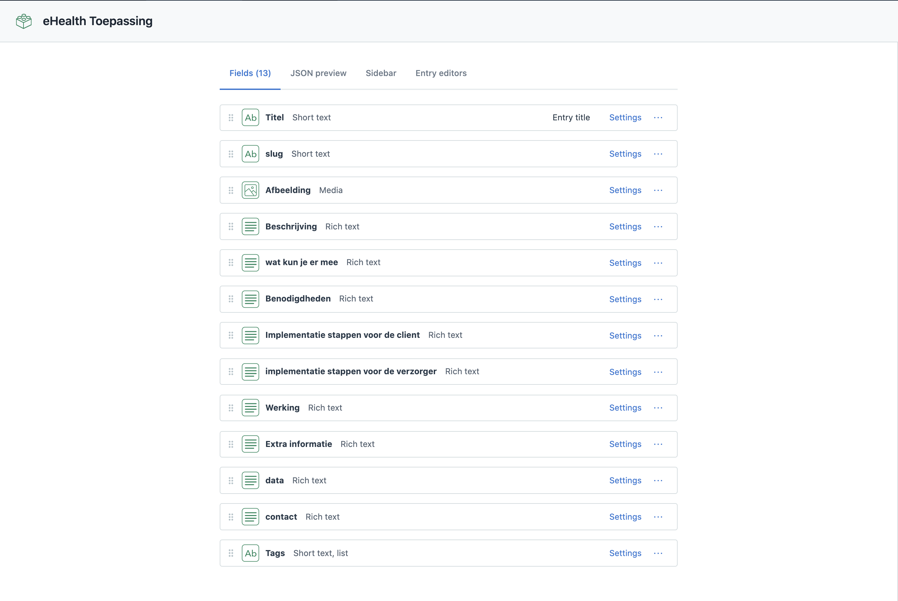

# Meesterproef egilde-prototype · 2020/21
Een dashboard voor e-health toepassingen


## Live link:
https://egilde.herokuapp.com/

## Documentatie
https://www.notion.so/eGilde-fd03dab3bf5e4ef296aaa7b48455de9c

## Eindpresentatie
https://docs.google.com/presentation/d/1ndGJL6KmD7SnRpXHvcu8-71lGLR2oY_rSWjdwSSGJQg/edit?usp=sharing

## Table of Contents
- Beschrijving 
- Moscow
- Headless CMS
  - Welke API hebben wij gebruikt
  - API Inhoud
  - Hoe gebruikt
  - API key
- Resources
- Used Packages
- Install project

## Beschrijving
De opdrachtgever van het project eGilde van de meesterproef 2021 is de Gezondheidsfabriek samen met Digital Life Center. Veel technologische innovaties worden in de zorg niet gebruikt, omdat het implementatie proces niet soepel verloopt. In het eGilde project proberen ze dit te verbeteren door middel van een productklapper en deze te digitaliseren. In deze productklapper staan 17 eHealth toepassingen die cliënten moeten helpen in het dagelijkse leven. Denk aan kleine sensoren die geplaatst worden om vallen bij ouderen te voorkomen of bijvoorbeeld een smartwatch met agenda die ouderen met geheugen moet helpen. 

### Features:
- Slim filteren
- Snel zoeken
- Toepassingen vergelijken
- Recent bekeken
- Populair

### Hoe te bouwen:
- CMS inrichten
- Content plaatsen
- Begin van de HTML, CSS en JS opzetten
- CMS call
- Maken van producten en detailpage
- Filter en zoek maken

## Moscow
### Must have:
- [x] 17 ehealth toepassingen digitaliseren
- [x] Filter
- [x] Zoeken
- [x] Onderzoek naar gebruiker

### Should have:
- [x] Testen met gebruikers
- [x] OMAHA stappen filter

### Could have:
- [x] Recent bekeken
- [x] Vergelijk functie

### Would have but won't right now:
- [ ] Like functie
- [ ] Populairste items
- [ ] Nieuwste items
- [ ] User feedback laten geven
- [ ] Verschillende browser ondersteuningen. Uit test bleek dat website niet werkt op Internet Explorer, zouden ook andere browsers moeten testen.
- [ ] App ipv website

## Headless CMS
### Welke API:
Contentful

### API Inhoud:


### Hoe gebruikt:
- CMS entries ophalen: 

```js
const client = contentful.createClient({
		space: process.env.SPACE_ID,
		environment: process.env.ENV_ID,
		accessToken: process.env.API_KEY
	})

const entries = await client.getEntries()

const { items } = entries
```

- Tags uit cms entries transformeren naar consistente tags

```js
const transformedEntries = items.map(item => {
		item.fields.tags = replaceWhitespaceAndSlashWithHyphen(item.fields.tags)
		return item
})

function replaceWhitespaceAndSlashWithHyphen(array, property, storeProperty) {
	if(property) {
		return array.map(item => 
			item[storeProperty] = cleanUp(item[property]))
	}
	return array.map(item => cleanUp(item))
}


function cleanUp(st) {
	return st
	   .replace(/[^a-z0-9]+/gi, '-')
	   .replace(/^-+/, '')
	   .replace(/-+$/, '')
	   .toLowerCase()
}
```
### API key:
Op de website van contentful kun je inloggen aan de hand van verschillende bestaande accounts, of je kan een nieuwe aanmaken. Nadat deze is aangemaakt kun je een space aanmaken voor jouw website. Nadat deze space is gemaakt kun je op de tab settings klikken waarna de optie API keys wordt getoond. Als op deze link geklikt wordt ga je naar de pagina waar de API keys staan voor jouw space. Als laatste moet je nog naar settings gaan en dan naar environments om een environment in te stellen. 

Als dit allemaal geconfigureerd is kun je met JavaScript met het npm pakketje contentful, een client aanmaken en vervolgens hiermee data uit het CMS ophalen.

```js
const client = contentful.createClient({
		space: process.env.SPACE_ID,
		environment: process.env.ENV_ID,
		accessToken: process.env.API_KEY
	})
```

Gebruik hiervoor deze twee websites: 
- Voor extra informatie kun je terecht op de docs van [Contentful](https://www.contentful.com/developers/docs/)


## Resources

- [Contentful entries](https://www.contentful.com/developers/docs/references/content-delivery-api/#/reference/search-parameters/content-type/query-entries/console/js)

## Used Packages
- @contentful/rich-text-html-renderer
- contentful
- cookie-parser
- dotenv
- ejs
- express
- mongoose
- node-fetch
- node-sass-middleware
- node-sass
- nodemon


## Install project
1. clone repo: 
``` 
https://github.com/Chazzers/egilde-prototype.git
```
2. Install used packages: 
```
npm install
```
3. Start op het web: 
```
npm run dev
```
4. Te vinden op: http://localhost:3000/
